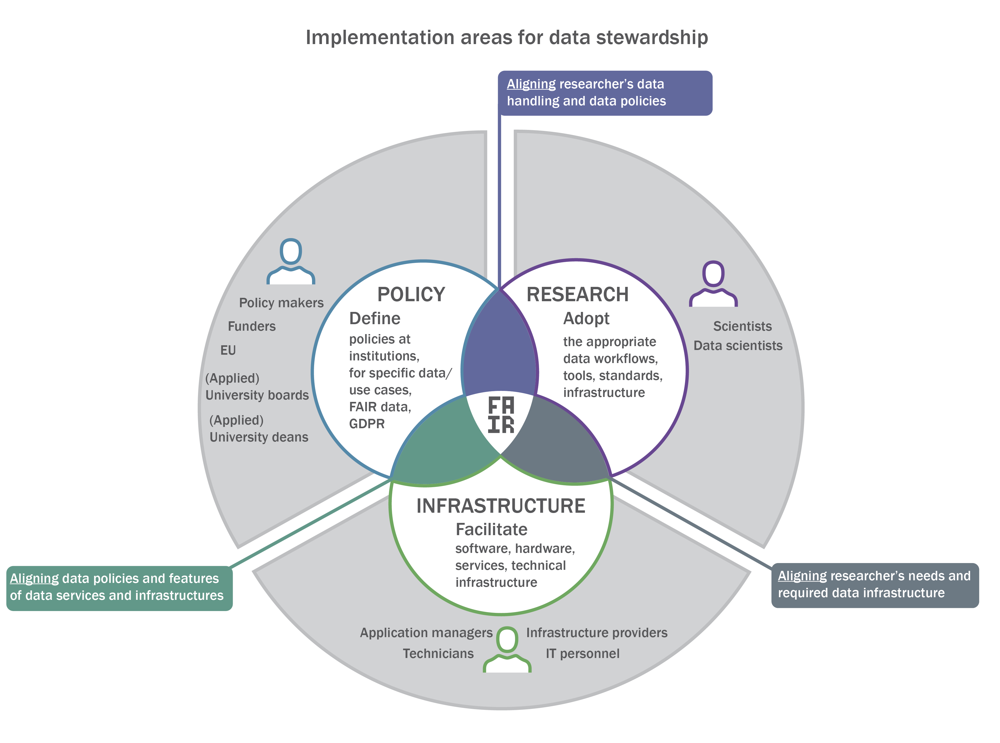

# About

## The Three Working Areas of Data Stewards

*https://doi.org/10.5281/zenodo.3460552*

Data stewards operate at the intersection of three stakeholder groups:

- Policy makers — funders, universities, EU bodies, deans; they define how data should be handled.
- Researchers and data scientists — they produce and analyse data and must remain empowered to do research while staying policy‑compliant.
- Infrastructure and IT providers — ICT staff, technicians, application managers; they provide the tools that implement data policies.

Each group has its own terminology, priorities, and constraints.
Data stewards translate between them but translation only works when the infrastructure itself is coherent, predictable, and FAIR‑aligned.

This book focuses on that infrastructure: the systems and architectural patterns that make the steward’s bridging role technically possible.

## Structure of the Book

The book is organised into several major parts:

- **Conceptual Foundations** — repositories, policy engines, metadata services, PID systems, storage, and how they relate.
- **From Components to a Platform** — how specialised services become a coherent RDM platform through orchestration, shared schemas, and lifecycle transitions.
- **FAIR as Infrastructure Requirements** — what Findable, Accessible, Interoperable, and Reusable mean for system design.
- **Transitions in the RDM Lifecycle** — where identity, metadata continuity, and provenance are preserved or lost.
- **Examples and Boundary-Spanning Tools** — including FAIRDOM‑SEEK and FAIR Data Station, which combine linked data, DOIs, and file storage and therefore span multiple categories of RDM services.
- **Designing a FAIR-Aligned RDM Platform** — architectural patterns, integration strategies, and orchestration layers.

Each chapter is self‑contained but designed to build toward a coherent understanding of RDM infrastructure.